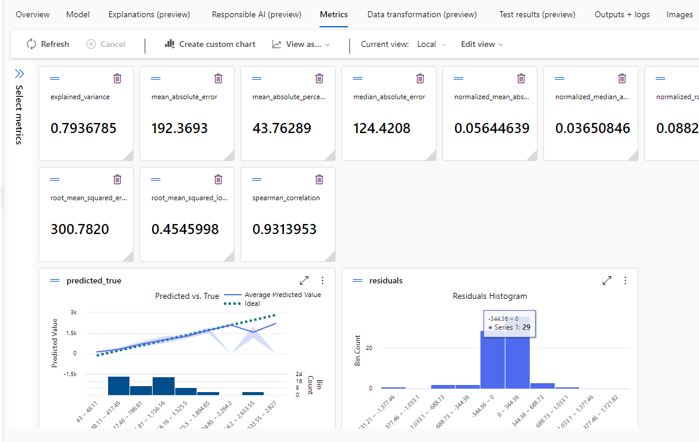
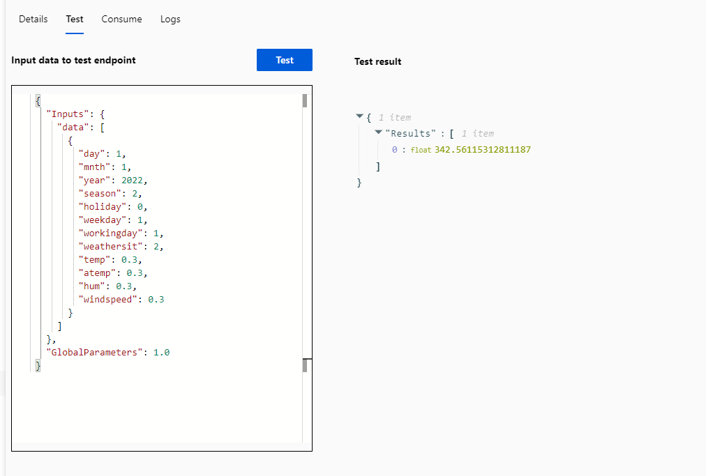

# AzureIA-900-DIO
## Projeto do Curso de Machine learning na Dio🧠🖥️

O estudo Foi guiado pela educadora e pela documentação  [documentação](https://microsoftlearning.github.io/mslearn-ai-fundamentals/Instructions/Labs/01-machine-learning.html), onde foi feito o passo a passo onde foi iserido dados públicos de alugel de bicicletas.
 Com tais dados inseridos, a IA apresentou a probabilidade de aluguel conforme testes praticos na plataforma.

com as condições abaixo passadas como parametros por aruqivo Json(dia,mes,ano...,vento,humidade...), foi obtido o seguinte retorno da IA

 Em resumo, o aprendizado foi muito válido onde foi possível em prática configurar os parametros e inserir dados para usar a IA da Azure de forma a obter resultados ficitícios porem de situações reais.